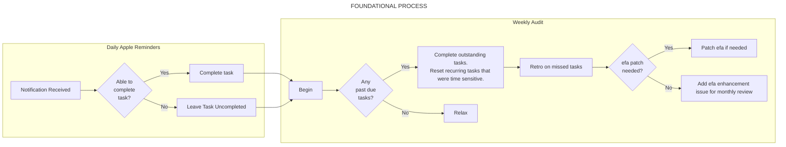
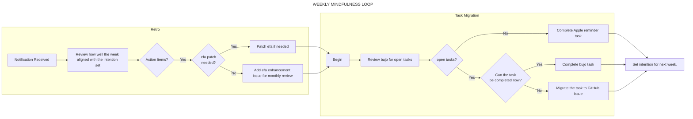
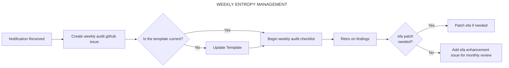
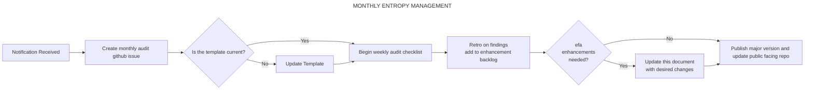

# Executive Functioning Assistant Process and Design

## Standing Personal Agreements

- Limit major changes to this system to a monthly basis
  - This provides time to truly test a process
  - Limits time spent on over optimization
  - Builds resilience
  - Promotes development of internalized mindfulness loop.

## Process

### Daily



- There are many daily reminders
- Some are individual tasks and other are triggers to start checklists.
- The reminders are set at a frequency where if for whatever reason, the task is not completed, it will show as overdue until it is due again.
- If the natural cycle doesn't pick it up, the weekly retro and weekly audit are designed as a safety net.

### Weekly

#### *Friday evening*



- Task Migration - identify all uncompleted tasks then either:
  - Do the task
  - Convert the task into a github issue for the appropriate project
  - Add the task to google calendar
  - Add the task to apple reminders with the correct due date
  - Cancel the task
- Retrospective
  - Review how well the week went compared to the intention set.
  - Identify what went well
    - Low anxiety
    - Accomplishments
    - Positive interpersonal relationships
    - etc
  - Identify what didn't go well and determine if there are lifestyle changes needed.
    - Missed or late appointments or meetings
    - Over spending
    - Anxiety or depression
    - etc
  - Record any EFA process changes into the efa gh project.
- Intention setting
  - What is the focus for next week?
  - Keep it focused on desired outcomes rather than specific actions.

#### *Sunday evening*



- Verify GitHub weekly audit template is current
  - Update if needed.
- Create new GitHub issue for the week
- Follow the checklist in the issue
  - Verify I haven't forgotten to follow the efa process and to update tools if I have forgotten.
  - This also has a side effect of building trust in my process when I review and see that everything is working.
- Introduce small patch changes to this process if needed.
- Capture efa enhancements with GitHub issue in this repo tagged with `enhancement`

### Monthly



- Retro on EFA process and make adjustments based on finds recorded in efa project issues
- Update this document to reflect process changes.
- Add additional month of entries to bujo
- Create new version release in github
- Update public facing repo to share with others.

### Quarterly and Yearly

Same process at monthly at this point.

## Known Gaps And Limitations

Why you might not want to adopt this yet.

### Task Execution

The current design phase is focused on only capturing and raising awareness of what I currently have going on. I have not yet designed the system and process for prioritizing and scheduling tasks. That should be coming up soon and I will be exploring that in June 2023. So the current system will help you become aware of all the things you are not doing which can be a source of anxiety.

### Cumbersome

The current process is time consuming as I am still in the design and implement phase so there is a lot of heavy lifting with documentation and trying to establish new routines. This will get faster as I start moving these tasks from working memory to habitual behavior. Once project the shifts from design and development to maintenance this burden should be reduced.

## Tools & Configurations

### [Bullet Journal](https://bulletjournal.com/) (BuJo)

- purpose
  - is the field note and task tracker.
  - This works well for situations where phone or laptop use would not be socially appropriate and to minimize distractions.
- configuration
  - I keep the BuJo at a weekly scale and no more. Anything longer out than that should be tracked in a tool with automated reminders
  - Each "section" is given an entire page to build out a planner style
  - Weeks end on Friday nights
  - Each week has a the following sections in this order:
    - Weekly Retro | The Week's Goals (on same page)
    - Daily Entry (Saturday - Friday)

### Apple Reminders

- purpose
  - used for recurring reminders and rapid notes
- configuration
  - All reminders must have a due date
  - Recurring reminders should be tagged with a frequency indicator so they can appear on a `smart list` to quickly reference what active reminders are present.
  - efa reminder list used for capturing rapid notes when bujo is not available, always set a reminder.
  - A `smart list` showing tasks with no due date or location trigger should be created to assist with audit process.
  - Current Reminders:
    - Daily:
      - PT Exercises: 6:50a
      - EFA - BuJo / GH project Morning Review: 7:15a
      - 10mg: 8a
      - Have courage to be disliked: 8:44a
      - EFA - BuJo Mid-Day Review: 12p
      - PT Exercises: 12p
      - 10mg: 12p
      - 10mg: 4p
      - Fill Out Actitime: 4p
      - EFA - GH Project Review: 4:30p
      - EFA - BuJo Evening Review: 6p
      - PT Exercises: 6p
      - 🛑 note current task - begin bedtime routine: 9:40p
    - Weekly
      - EFA - BuJo Retro / Task Migration: Fridays 4:30p
      - EFA - audit all systems and prioritize project cards: Sundays 4:30p
      - EFA - Check Amazon Subscribe and Save: Sundays
    - Monthly
      - Retro on EFA and make small changes as noted from retros: 19th
      - Request Rx Refill: 26th
      - Pay extra on Apple Card: 30th

### Google Calendar

- purpose
  - with notifications is used for tracking meetings and appointments.
- configuration
  - All future events, single or recurring, should be added to Google Calendar.
  - Each event should have automated reminders that fire when action should be taken.
  - Email, SMS, and Push notifications should be enabled
  - Work events do not need to be on personal calendars.
  - Personal events occurring during work hours should be added to work calendars.
  - Calendar events should be configure to default with reminders 1 day, 45 minutes, and 1 hour before the event.

### GitHub

- purpose
  - is used for project tracking and tasks that need migration.
- configuration
  - repos
    - Created from a project template.
    - Use markdown files for documenting long form / archival content
    - Folder structure is dependant on the projects needs
  - issues
    - Used for non recurring, non due date, long term tasks.
    - Issues are tied to project repos
    - Issues are sized and prioritized
  - project
    - GitHub project with tabs of each repo should be created
    - Tab called inbox should be configured for issues in this repo with the tag `inbox`
    - Tabs to list issues by priority and by size should be created to help with grooming and audit process

### Apple Watch

- purpose
  - is used for minimalist reminder notification, tracking health, and quick voice memos.
- configuration
  - Configured to receive push notifications from iPhone
  - Disable alarm notifications (alarms related to sleep cannot be disabled)
  - Watch face should default to so solar chart for daylight awareness
  - Adjust watch face settings so links to heart rate, voice memo, tasks, and strava are easy to access
  - Watch face should show current temp and the day's high and low.

### iPhone

- purpose
  - used for alarms, apple watch support, and rapid notes when bujo is not available.
- configuration
  - Configure sleep schedule with an alarm
  - Configure second alarm a few minutes after the sleep alarm as a failsafe
  - Place phone out of reach from bed with MagSafe battery pack attached

### Philips Hue

- purpose
  - is used for promoting sleep hygiene and aiding on waking.
- configuration
  - Morning
    - 6am, fade 15 min, whole house: Relax
    - 6:29am, fade 15 min, whole house: Concentrate (cool white)
  - Evening
    - 120 min before sunset, instant, whole house: Bright (warm white)
    - 15 min before sunset, fade 15 min, whole house: Tropical Twilight
  - Night
    - 9pm, fade 15 min, whole house: Dark Nordic
    - 10:15p, fade 20 min, whole house: Off

### Amazon Subscribe and Save

- purpose
  - for recurring domestic consumables
- configuration
  - Supplements: monthly
  - Dishwasher pods: monthly
  - Imodium: every 2 months
  - Clif Bars: monthly
  - Verb Ghost Prep: every 4 months

### Whiteboard

- purpose
  - quick notes and brainstorming
- configuration
  - VA Appointment mail letters
  - Storm Spotter Number: DL3006
  - Meal prep scale adjustments
    - Instant pot liner: -1292g
    - Metal Mixing Bowl: -626g

### Voice Recorder

- purpose
  - is for brain dumping thoughts that otherwise cause rumination
- configuration
  - Sony PCM-A10
  - Internal memory storage
  - REC Mode: MP3 320kbps
  - Scene Select: Voice Memos
  - Auto Gain Ctrl: For Voice

### Pipe Dream

- purpose
  - is a pipeline that takes voice memo recordings and leverages openAI for transcription and analysis into a GitHub issue.
- configuration
  - Workflow: Voice to GH with Analysis
    - Trigger: New File in voice-memo google drive Folder
    - Step: Download file
      - File `{{steps.trigger.event.id}}`
      - Destination File Path `/tmp/recording.{{steps.trigger.event.fullFileExtension}}`
    - Step: Create Transcription
      - File Path `/tmp/recording.{{steps.trigger.event.fullFileExtension}}`
      - Prompt `Transcribe the audio file. Add proper punctuation after each sentence.`
      - Language `English en`
      - Response Format `json`
    - Step: chat
      - Model `gpt-3.5-turbo`
      - User Message:

          ```text
          Write a Title for the transcript that is under 15 words.

          Then write: "--Summary--"

          Write "Summary" as a Heading 1.

          Write a summary of the provided transcript.

          Then write: "--Additional Info--".

          Then return a list of the main points in the provided transcript. Then return a list of action items. Then return a list of follow up questions. Then return a list of potential arguments against the transcript.

          For each list, return a Heading 2 before writing the list items. Limit each list item to 100 words, and return no more than 5 points per list.

          Transcript:

          {{steps.create_transcription.$return_value.transcription}}
          ```

      - System Instructions:

          ```text
          You are an assistant that only speaks in Markdown. Do not write text that isn't formatted as markdown. You may use markdown extended syntax. Action Items should use checkbox markdown syntax.
          You are also an assistant that functioning like a prosthetic to support externalization of executive functioning for an individual diagnosed with ADHD. 

          Example formatting:

          Testing No-Code Workflow

          --Summary--

          This audio recording documents a test of a no-code workflow using Google Drive and a single code step to reduce calls and improve efficiency.

          --Additional Info--

          ## Main Points

          - point 1
          - point 2

          ## Action Items

          - [ ] point 1
          - [ ] point 2

          ## Follow Up Questions

          - point 1
          - point 2

          ## Potential Arguments Against

          - point 1
          - point 2
              
          ```

      - Temperature `0.2`
    - Step: Formatter
      - code:

          ```javascript
          export default defineComponent({
          async run({ steps, $ }) {
              
              const options = { timeZone: "America/Chicago", timeZoneName: "short" };
              const results = {
              title: "",
              transcript: "",
              summary: "",
              additional_info: "",
              creation_time: new Date(steps.trigger.event.modifiedTime).toLocaleString("en-US", options)
              }

              // Add line breaks to the transcript
              const originalTranscript = steps.create_transcription.$return_value.transcription

              function splitStringIntoSentences(str) {
                  
              // If the provide string is null, return an array with an error message.
              if (!str) {
                  const noTranscript = ["Null argument"]
                  return noTranscript
              }

              if (str.match(/(?:^|[^.!?]+)[.!?]+\s?/g) == null) {
                  str += str + "."
              }
              
              const sentences = str.match(/(?:^|[^.!?]+)[.!?]+\s?/g) || [] // split into sentences
              
              const result = []

              if (sentences.length > 1) {
                  for (let i = 0; i < sentences.length; i += 3) {
                  result.push(sentences.slice(i, i + 3).join(' ')) // join 3 sentences
                  } 
              } else {
                  const maxLength = 800;
                  const words = sentences[0].split(' ');
                  let currentLine = '';
              
                  for (let i = 0; i < words.length; i++) {
                  const word = words[i];
                  const lengthWithWord = currentLine.length + word.length;
              
                  if (lengthWithWord <= maxLength) {
                      currentLine += (currentLine.length === 0 ? '' : ' ') + word;
                  } else {
                      result.push(currentLine);
                      currentLine = word;
                  }
                  }
              
                  if (currentLine.length > 0) {
                  result.push(currentLine);
                  }
              }

              return result
              }

              function joinArrayWithBlankLine(arr) {
              return arr.join('\n\n')
              }


              const transcriptArray = splitStringIntoSentences(originalTranscript)

              results.transcript = joinArrayWithBlankLine(transcriptArray)

              // Extract the summary
              const summary = steps.chat.$return_value.choices[0].message.content

              function splitSummary(str) {
              const titleDelimiter = /^.*\n\n/
              const summaryDelimiter = /\n\s*?--Summary--\s*?\n\s*/
              const additionalInfoDelimiter = /\n\s*?--Additional Info--\s*?\n\s*/;

              const titleMatch = str.match(titleDelimiter)
              const summaryMatch = str.match(summaryDelimiter)
              const additionalInfoMatch = str.match(additionalInfoDelimiter)

              if (!titleMatch || !summaryMatch || !additionalInfoMatch) {
                  console.log("One or more delimiters not found")
                  return str
              } else {
                  const titleIndex = titleMatch.index
                  const summaryIndex = summaryMatch.index
                  const additionalInfoIndex = additionalInfoMatch.index

                  results.title = str.slice(0, titleIndex + titleMatch[0].length).trim().replace(/^#\s*/,"").replace(/^"|"$/g, '')
                  results.summary = str.slice(summaryIndex + summaryMatch[0].length, additionalInfoIndex).trim()
                  results.additional_info = str.slice(additionalInfoIndex + additionalInfoMatch[0].length).trim()
              }
              }

              splitSummary(summary)

              // Return the results object
              return results

          },
          })
          ```

    - Step: Create Issues
      - GitHub Account `k4mp3r`
      - Repository `k4mp3r/executive-functioning-assistant`
      - Title: `{{steps.formatter.$return_value.creation_time}} | {{steps.formatter.$return_value.title}}`
      - Body:

          ```text
          [google drive]({{steps.trigger.event.webViewLink}})
          ## Summary
          {{steps.formatter.$return_value.summary}}
          {{steps.formatter.$return_value.additional_info}}
          ## Transcript
          {{steps.formatter.$return_value.transcript}}
          ```

      - Labels `Transcription` `inbox`
  - Workflow: Voice to GH w/out Analysis
    - Trigger: New File in voice-memo-no-analysis google drive Folder
    - Step: Download file
      - File `{{steps.trigger.event.id}}`
      - Destination File Path `/tmp/recording.{{steps.trigger.event.fullFileExtension}}`
    - Step: Create Transcription
      - File Path `/tmp/recording.{{steps.trigger.event.fullFileExtension}}`
      - Prompt `Transcribe the audio file. Add proper punctuation after each sentence.`
      - Language `English en`
      - Response Format `json`
    - Step: chat
      - Model `gpt-3.5-turbo`
      - User Message:

          ```text
          Write a Title for the transcript that is under 15 words.
          
          Then write: "--Summary--"
          
          Write "Summary" as a Heading 1.
          
          Write a summary of the provided transcript.
          
          Transcript:
          
          {{steps.create_transcription.$return_value.transcription}}
          ```

      - System Instructions:

          ```text
          You are an assistant that only speaks in Markdown. Do not write text that isn't formatted as markdown. You may use markdown extended syntax. You are also an assistant that functioning like a prosthetic to support externalization of executive functioning for an individual diagnosed with ADHD.
          
          Example formatting:
          
          Testing No-Code Workflow
          
          --Summary--
          
          This audio recording documents a test of a no-code workflow using Google Drive and a single code step to reduce calls and improve efficiency.
              
          ```

      - Temperature `0.2`
    - Step: Formatter
      - code:

          ```javascript
          export default defineComponent({
              async run({ steps, $ }) {
                  
                  const options = { timeZone: "America/Chicago", timeZoneName: "short" };
                  const results = {
                  title: "",
                  transcript: "",
                  summary: "",
                  creation_time: new Date(steps.trigger.event.modifiedTime).toLocaleString("en-US", options)
                  }

                  // Add line breaks to the transcript
                  const originalTranscript = steps.create_transcription.$return_value.transcription

                  function splitStringIntoSentences(str) {
                      
                  // If the provide string is null, return an array with an error message.
                  if (!str) {
                      const noTranscript = ["Null argument"]
                      return noTranscript
                  }

                  if (str.match(/(?:^|[^.!?]+)[.!?]+\s?/g) == null) {
                      str += str + "."
                  }
                  
                  const sentences = str.match(/(?:^|[^.!?]+)[.!?]+\s?/g) || [] // split into sentences
                  
                  const result = []

                  if (sentences.length > 1) {
                      for (let i = 0; i < sentences.length; i += 3) {
                      result.push(sentences.slice(i, i + 3).join(' ')) // join 3 sentences
                      } 
                  } else {
                      const maxLength = 800;
                      const words = sentences[0].split(' ');
                      let currentLine = '';
                  
                      for (let i = 0; i < words.length; i++) {
                      const word = words[i];
                      const lengthWithWord = currentLine.length + word.length;
                  
                      if (lengthWithWord <= maxLength) {
                          currentLine += (currentLine.length === 0 ? '' : ' ') + word;
                      } else {
                          result.push(currentLine);
                          currentLine = word;
                      }
                      }
                  
                      if (currentLine.length > 0) {
                      result.push(currentLine);
                      }
                  }

                  return result
                  }

                  function joinArrayWithBlankLine(arr) {
                  return arr.join('\n\n')
                  }


                  const transcriptArray = splitStringIntoSentences(originalTranscript)

                  results.transcript = joinArrayWithBlankLine(transcriptArray)

                  // Extract the summary
                  const summary = steps.chat.$return_value.choices[0].message.content

                  function splitSummary(str) {
                  const titleDelimiter = /^.*\n\n/
                  const summaryDelimiter = /\n\s*?--Summary--\s*?\n\s*/
                  
                  const titleMatch = str.match(titleDelimiter)
                  const summaryMatch = str.match(summaryDelimiter)

                  if (!titleMatch || !summaryMatch) {
                      console.log("One or more delimiters not found")
                      return str
                  } else {
                      const titleIndex = titleMatch.index
                      const summaryIndex = summaryMatch.index

                      results.title = str.slice(0, titleIndex + titleMatch[0].length).trim().replace(/^#\s*/,"").replace(/^"|"$/g, '')
                      results.summary = str.slice(summaryIndex + summaryMatch[0].length).trim()
                  }
                  }

                  splitSummary(summary)

                  // Return the results object
                  return results
              },
          })
          ```

    - Step: Create Issues
      - GitHub Account `k4mp3r`
      - Repository `k4mp3r/executive-functioning-assistant`
      - Title: `{{steps.formatter.$return_value.creation_time}} | {{steps.formatter.$return_value.title}}`
      - Body:

          ```text
          [google drive]({{steps.trigger.event.webViewLink}})
          ## Summary
          {{steps.formatter.$return_value.summary}}
          ## Transcript
          {{steps.formatter.$return_value.transcript}}
          ```

      - Labels `Transcription` `inbox`

### BetaBrand Holster

- purpose
  - used for carrying EFA tools and important medications.
- configuration
  - [ ] TODO: Figure out and mark holes for hip and shoulder configuration

### Checklists

- purpose
  - physical or digital, designed to support routine tasks and encourages formation of new habits.
- configuration
  - Managed in [Checklist Repo](https://github.com/k4mp3r/efa-checklists)
  - Checklist templates kept in markdown
  - Physical checklists are kept in word doc in same directory as markdown file
  - Printed checklists have efa version number for reference.

### Popl

- purpose
  - used for sharing contact info.
- configuration
  - Managed [here](https://dash.popl.co/profile/1255695)
